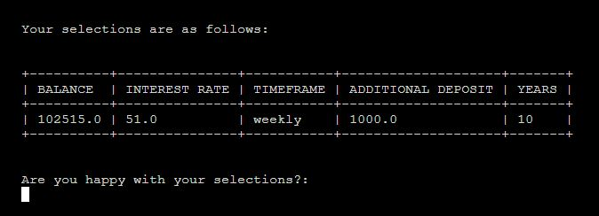

# Investment Calculator

I built an investment calculator in the hopes of showing the user the power of consistent long-term investing and saving. My inspiration for the project 
was a compound calculator site I personally use https://www.thecalculatorsite.com/finance/calculators/forex-compound-calculator.php. 

live website deployment https://investment-calculator-ewc.herokuapp.com/. 

# HOME PAGE  

  - The programme starts with the quote "Most people overestimate what they can do in one year and underestimate what they can do in ten years" - Bill Gates. This is motto that applies to many things in life but especially to saving and investing. 
  - The user is given the Goal of the calculator "This calculator has been built to show the power of consistent long term saving and investing" to show the creators aim. 
  

# USER INPUTS

  - The user is prompted with 5 inputs, each input displays after the previous has been completed: 
    - The first input the user is required to complete is to enter their starting balance. This is the starting amount of money they are willing to invest. 
    - The second input requires the user to enter the interest rate. This could be an expected return on a numbers of shares they hold, their current pension investment fund or the interest rate on a loan or mortgage. 
    - User is then asked for the increment timeframe and given the options "daily", "weekly", "monthly" or "yearly". If the user selects "weekly" the interest rate they have selected will be added to the starting balance each week, 52 times in a year. If they select "monthly" the interest rate will be added to their starting balance 12 times over the course of a year. 
    - The user is then give the option to add an additional deposit amount at each increment stage. If the user enters 1000, a 1000 will be added to the starting balance at each increment timeframe. 
    - The 5th input requires the user to enter the investment period length in years. There is no limit apllied to this so they can calculate the investment over 200 years if they wish. 
  - Once the User has completed all 5 inputs they will be shown their selections and asked if they are happy with their selections: 
  
    - If the User advises yes they are happy with their selections the programme will proceed to calculate their investment. 
    - if the User advises no the programme will restart allowing them to enter new inputs. 
  - All inputs include input validation which will print a error message in red to the user if the user letters for a number input or numbers for a text input. 
  

# USER RESULTS 

- The Users results will be displayed in table format, displaying the deposits, gain and balance the User will have accrued at the end of each year. 

  - The deposits amount is the total amount the user has invested over the years minus their starting balance. 
  - The gain is the total amount of interest the user gains on his investment each year. 
  - The balance is the Users end of year balance made up of the deposits, gain and starting balance. 

# USER EXPERIENCE

### First Time User 
- As a first time user I would like the programme to be easy to understand and allow the User to quickly identify the purpose of the programme. 
- The purpose of the programme is identified to the user from the title and goal of the programme which is displayed in text to the user. 
- The programme is easy to use as the User is prompted with inputs detailing what they need to enter. 
If the user enters the wrong input they will be giving an error message advising of the correct
input to enter so they can re-enter correctly. 

- Once the user completes all of the inputs the programme does the rest of the work and calculates the User's investment. 
- A first time user may want to calculate the projected return on a stock they hold for the next 5 years or calculate the projected return of their pension 
fund over the next 35 years. At the end of the programme the user will be provided with the deposit total, interest gained and total balance each year over the investment period. 

### Returning User experienece 
- A returning user to the programme will be familiar with the programme controls. 
- A User may return a year after their original calculation to compare their previous results based on their actual interest gain over the past year. 
- A returning user may want to calculate the return of a famous investor they have seen on the news or in a movie and calculate their returns over a longer investment period. 

# DEPLOYMENT
- The site was deployed to Heroku. The live link can be found here https://investment-calculator-ewc.herokuapp.com/. 

# PLANNING

### Lucidchart

- Lucidchart was used to plan the project prior to beginning coding. I listed the features I needed to implement in the project and the flow of user inputs I would require. Mock up code was also drafted up with the help of Python Tutor to get the basis of the project planned. 

### Python Tutor 

- Python Tutor was a huge help in the beginning of the planning stages of the project as I was able to plan out the base code before starting. It gave me a lot of confidence throughout the project and helped improve my thought process when looking for solutions to code problems. 

# TECHNOLOGIES AND LIBRARIES USED 

### Languages used 
- Python
- HTML5
- CSS3

### Lucidchart 
- Used for project planning. 

### Python Tutor 
- Used for code testing and troubleshooting code errors. 

### GitHub
- Used to store code commits and project deployment. 

### Heroku
- Used for project deployment.

### Colorama
- Used for adding color to the programme. Red was specifically used as the color text for errors in user input validation. 

### Tabulate 
- Used to form user selections and results into table format. 

### Pyfiglet 
- Used to style the programme title. 

# DESIGN 

### Colors Used 
- Black, Green, Red and White from Colorama. 
- Green was used for the programme title and end statement. 
- Red was used to color the error text when a user's input was invalid. 
- White was the default text color for the programme which provided a clear contrast to the black background. 

### Style 
- Terminal and run programme button are centered using CSS flexbox. 
- Typewrite function has been implemented to print long lines of text out slower to the user so they are able to read along. 
- All programme text is seperated by two blank text rows to give adequate spacing. 

# TESTING

### Code Validators 
- Code passed through PEP8 with no significant errors. 

### Calculation Testing
- All calculator results, deposits, gains and balance at the end of each year were compared to same results using https://www.thecalculatorsite.com/finance/calculators/forex-compound-calculator.php. 

### Input Validation Testing 
- All incorrect inputs prompt the user with a error message and explain to the user the reason why the entry was incorrect. All input validation was tested thoroughly. 

### Python Tutor 
- Used to walkthrough code to find the source of code errors. 

# BUGS 
### Format Error 1

- When the yearly increment option was selected results were displaying as above. Duplicating the last two lines of the results. 
- This was an error in the loop order, error fixed by moving the year_end_list = [] inside of the last if i == increments: statement.

### Format Error 2 
- I did not want to limit the length of the numbers the User can enter into the inputs so as a result the results table was not formating correctly 
when the end of year figures were in excess of 30+ digits. 
- In order to fix this error I used a If statement and the format method. If the figure is more than 20 digits in length it will save as a 
exponential number, if it is less than 20 digits it will save as normal. 20 digits is more than enough room to give the User without 
limiting the programme as there are currently no Quintillionaires in the world. 

# CREDITS 

### Typewrite Function 
- Typewrite function was copied directly from the Youtube video https://www.youtube.com/watch?v=A_1THfBpCH8&list=LL&index=1. 

### Restart Function 
- Restart function was copied directly from https://www.daniweb.com/programming/software-development/code/260268/restart-your-python-program. 

### Forex Compound Calculator 
- Forex Compound Calculator was the inspiration for the project but no code was copied from this website. https://www.thecalculatorsite.com/finance/calculators/forex-compound-calculator.php. 

